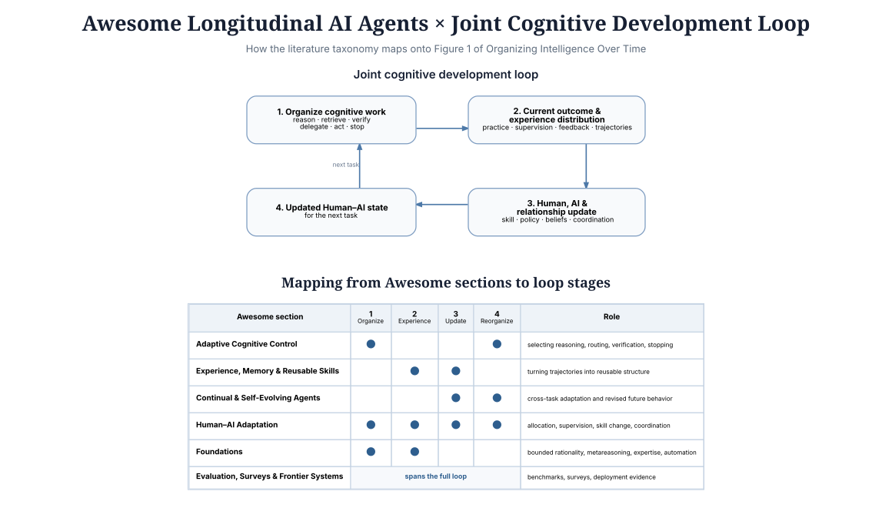

# Awesome Longitudinal AI Agents

**A curated map of research on a single longitudinal question:**  
**how does experience from earlier work change later work?**

**Longitudinal AI agents** are systems whose history of work changes how they work later. Experience from earlier tasks or interactions may alter what an agent remembers, which procedures or skills it reuses, how it allocates reasoning and verification, when it asks for help, or how a human–AI team coordinates over time.

This list maps research on that longitudinal dimension: persistent experience, experiential learning, reusable workflows and skills, continual and self-evolving agents, adaptive cognitive control, repeated Human–AI adaptation, and evaluation over histories of interaction. It accompanies the survey [**Organizing Intelligence Over Time**](https://kevincl16.github.io/organizing-intelligence-over-time.html).

  

> **Scope.** Continuity alone is not enough. A long context window, persistent session, generic RAG system, or one-shot Human–AI workflow belongs here only when retained history or repeated interaction materially changes later cognition, behavior, coordination, or capability.

## Contents

- [Experience, Memory & Reusable Skills](#experience-memory--reusable-skills)
- [Continual & Self-Evolving Agents](#continual--self-evolving-agents)
- [Adaptive Cognitive Control](#adaptive-cognitive-control)
- [Human–AI Adaptation](#humanai-adaptation)
- [Evaluation, Surveys & Frontier Systems](#evaluation-surveys--frontier-systems)
- [Foundations](#foundations)

## Experience, Memory & Reusable Skills

- [Agent Workflow Memory](https://proceedings.mlr.press/v267/wang25bx.html) — Wang et al., ICML 2025. Retrieves reusable workflow knowledge from earlier successful executions.
- [Procedural Graphs: Self-Evolving Execution Structures for LLM Agents](https://arxiv.org/abs/2609.09153) — Lu et al., arXiv 2026. Encodes procedural knowledge as an editable execution graph that is refined from successful and failed trajectories under held-out validation.
- [Reflexion](https://arxiv.org/abs/2303.11366) — Shinn et al., arXiv 2023. Converts verbal feedback from failed episodes into subsequent action guidance.
- [ExpeL](https://doi.org/10.1609/aaai.v38i17.29936) — Zhao et al., AAAI 2024. Extracts reusable experiential knowledge from trajectories.
- [Voyager](https://arxiv.org/abs/2305.16291) — Wang et al., arXiv 2023. Builds an ever-growing executable skill library in an open-ended environment.
- [Generative Agents](https://doi.org/10.1145/3586183.3606763) — Park et al., UIST 2023. Uses a memory stream, reflection, and planning to sustain agents across repeated interactions.
- [From Storage to Experience](https://doi.org/10.18653/v1/2026.findings-acl.2069) — Luo et al., Findings of ACL 2026. Surveys the transition from stored memory to agent experience mechanisms.
- [Learning How to Remember](https://doi.org/10.18653/v1/2026.findings-acl.1535) — Liang et al., Findings of ACL 2026. Learns structured memory management for transferable use.
- [Joint Learning of Experiential Rules and Policies](https://arxiv.org/abs/2606.27136) — Ye and Yu, arXiv 2026. Couples rule induction from experience with policy learning.
- [Self-Improving AI Coding Agents through Accumulated Behavioral Rules](https://arxiv.org/abs/2607.13091) — Aggarwal and Farhady Ghalaty, arXiv 2026. Feeds accumulated coding rules back into future agent runs.
- [Trace2Skill](https://arxiv.org/abs/2603.25158) — Ni et al., arXiv 2026. Distills local trajectory lessons into transferable skills.
- [Remember Me, Refine Me](https://doi.org/10.18653/v1/2026.findings-acl.829) — Cao et al., Findings of ACL 2026. Dynamically refines procedural memory as experience arrives.
- [Meta Context Engineering via Agentic Skill Evolution](https://arxiv.org/abs/2601.21557) — Ye et al., arXiv 2026. Evolves skills that restructure later context construction.
- [Prime Agent](https://arxiv.org/abs/2608.23552) — Karten et al., technical report 2026. Uses a harness to iteratively improve an RLM agent from prior outcomes.
- [Contextual Experience Replay for Self-Improvement of Language Agents](https://aclanthology.org/2025.acl-long.694/) — Liu et al., ACL 2025. Accumulates and synthesizes past trajectories into a dynamic memory buffer that is retrieved to guide later tasks.
- [Rethinking Experience Utilization in Self-Evolving Language Model Agents](https://arxiv.org/abs/2605.07164) — Zhao et al., arXiv 2026. Treats stored experience as an optional runtime resource and learns when it should enter later decision-making.
- [Experience Graphs: The Data Foundation for Self-Improving Agents](https://arxiv.org/abs/2606.29823) — Liao et al., arXiv 2026. Makes artifacts, tool outputs, rewards, comparisons, and causal lineage durable queryable state for cross-session reuse.
- [AgentFactory: A Self-Evolving Framework Through Executable Subagent Accumulation and Reuse](https://arxiv.org/abs/2603.18000) — Zhang et al., arXiv 2026. Preserves successful solutions as executable subagents that are refined from later execution feedback and reused across tasks.
- [GraphMind: From Operational Traces to Self-Evolving Workflow Automation](https://arxiv.org/abs/2605.17617) — Zhu et al., arXiv 2026. Builds workflow graphs from prior resolution traces and adapts them using feedback from subsequent executions.
- [Group-Evolving Agents: Open-Ended Self-Improvement via Experience Sharing](https://arxiv.org/abs/2602.04837) — Weng et al., arXiv 2026. Shares and reuses experience across evolving agent variants so exploratory diversity can become cumulative progress.
- [SkillRevise: Improving LLM-Authored Agent Skills via Trace-Conditioned Skill Revision](https://arxiv.org/abs/2606.01139) — Liu et al., Findings of EMNLP 2026. Revises reusable procedural skills from execution evidence and retains variants that empirically improve later runs.
- [ReasoningBank: Scaling Agent Self-Evolving with Reasoning Memory](https://arxiv.org/abs/2509.25140) — Ouyang et al., ICLR 2026. Distills generalizable reasoning strategies from successful and failed trajectories into memory that guides later tasks.
- [Mem2Evolve: Towards Self-Evolving Agents via Co-Evolutionary Capability Expansion and Experience Distillation](https://aclanthology.org/2026.acl-long.952/) — Cheng et al., ACL 2026. Couples experience distillation with creation of new tools and expert agents so accumulated experience expands later capability.
- [WebCoach: Self-Evolving Web Agents with Cross-Session Memory Guidance](https://arxiv.org/abs/2511.12997) — Liu et al., ICLR 2026. Curates cross-session episodic memory and injects advice distilled from earlier web trajectories into later sessions.
- [Beyond Meta-Reasoning: Metacognitive Consolidation for Self-Improving LLM Reasoning](https://arxiv.org/abs/2604.17399) — Zhuang et al., arXiv 2026. Consolidates reasoning, monitoring, and control traces from earlier episodes into reusable metacognitive knowledge for later reasoning.
- [Live-Evo: Online Evolution of Agentic Memory from Continuous Feedback](https://arxiv.org/abs/2602.02369) — Zhang et al., arXiv 2026. Updates the value of retained memories from subsequent outcomes so experience can be reinforced, downweighted, or forgotten over an online stream.
- [Memory Transfer Learning: How Memories are Transferred Across Domains in Coding Agents](https://arxiv.org/abs/2604.14004) — Kim et al., arXiv 2026. Studies cross-domain transfer of retained experience and shows that overly specific memories can produce negative transfer.
- [Self-Consolidation for Self-Evolving Agents](https://arxiv.org/abs/2602.01966) — Yu et al., arXiv 2026. Consolidates lessons from successful and failed trajectories into compact persistent experience rather than accumulating raw traces indefinitely.
- [RetroAgent: From Solving to Evolving via Retrospective Dual Intrinsic Feedback](https://arxiv.org/abs/2603.08561) — Zhang et al., arXiv 2026. Builds reusable language memory from retrospective feedback and retrieves prior experience by similarity, utility, and exploration value.
- [Evolving from Tool User to Creator via Training-Free Experience Reuse in Multimodal Reasoning](https://arxiv.org/abs/2602.01983) — Shen et al., arXiv 2026. Converts successful reasoning traces into reusable tools and maintains them through experience consolidation for later tasks.
- [Experience as a Compass: Multi-agent RAG with Evolving Orchestration and Agent Prompts](https://arxiv.org/abs/2604.00901) — Li et al., arXiv 2026. Uses accumulated experience to revise both multi-agent orchestration and individual agent prompts for subsequent work.

## Continual & Self-Evolving Agents

- [SkillRL](https://arxiv.org/abs/2602.08234) — Xia et al., arXiv 2026. Uses recursive skill-augmented reinforcement learning to evolve agents.
- [NeoHorse-1: Towards Recursive Self-Improvement via Agentic Post-Training with Routing Harness](https://arxiv.org/abs/2609.08183) — NeoHorse Team et al., arXiv 2026. Feeds routing signals, execution trajectories, and evaluation feedback into successive post-training mixtures through a prototype evaluation–selection–update loop.
- [MetaRSI / RSI2: A Meta-Recursive Self-Improving System for Recursive Self-Improving Systems Themselves](https://arxiv.org/abs/2609.06396) — Tan et al., arXiv 2026. Improves training data, agent harnesses, and model weights in repeated cycles, then uses past results to decide which part of the system to improve next.
- [Evolving-RL](https://arxiv.org/abs/2605.10663) — Fan et al., arXiv 2026. Optimizes experience-driven self-evolving capability end to end.
- [EvolveR](https://arxiv.org/abs/2510.16079) — Wu et al., arXiv 2025. Defines an experience-driven lifecycle for self-evolving agents.
- [Building Self-Evolving Agents via Experience-Driven Lifelong Learning](https://arxiv.org/abs/2508.19005) — Cai et al., arXiv 2025. Offers a framework and benchmark for lifelong agent evolution.
- [LifelongAgentBench](https://arxiv.org/abs/2505.11942) — Zheng et al., arXiv 2025. Evaluates whether LLM agents retain and adapt across tasks.
- [Agent Lightning](https://arxiv.org/abs/2508.03680) — Luo et al., arXiv 2025. Provides reinforcement-learning infrastructure for training heterogeneous agents.
- [SkillOS](https://arxiv.org/abs/2605.06614) — Ouyang et al., arXiv 2026. Learns to curate skills for a self-evolving agent.
- [Continual Harness: Online Adaptation for Self-Improving Foundation Agents](https://arxiv.org/abs/2605.09998) — Karten et al., arXiv 2026. Rewrites prompts, sub-agents, skills, and memory online from past trajectory data without resetting the environment.
- [FLEX: Continuous Agent Evolution via Forward Learning from Experience](https://arxiv.org/abs/2511.06449) — Cai et al., arXiv 2025. Converts successful and failed episodes into structured reusable experience and studies scaling and transfer across later tasks and agents.
- [Learning to Continually Learn via Meta-learning Agentic Memory Designs](https://arxiv.org/abs/2602.07755) — Xiong et al., arXiv 2026. Meta-learns memory schemas, retrieval, and update mechanisms from sequential experience so the agent can improve how it learns over time.

## Adaptive Cognitive Control

- [Scaling LLM Test-Time Compute Optimally Can Be More Effective than Scaling Model Parameters](https://arxiv.org/abs/2408.03314) — Snell et al., arXiv 2024. Studies how test-time compute should be allocated.
- [CoBa](https://arxiv.org/abs/2608.07424) — Zhou et al., arXiv 2026. Routes requests to balance accuracy against test-time cost.
- [Reason Wide, Not Deep](https://arxiv.org/abs/2608.07885) — Singh et al., arXiv 2026. Amortizes reasoning into distilled skills rather than repeated deep deliberation.
- [Just-In-Time Reinforcement Learning](https://arxiv.org/abs/2601.18510) — Li et al., arXiv 2026. Adapts an LLM agent continually without gradient updates.
- [Ask Only When Needed: Proactive Retrieval from Memory and Skills for Experience-Driven Lifelong Agents](https://arxiv.org/abs/2604.20572) — Cai et al., arXiv 2026. Learns when retained memory or skills should be reopened for a later task rather than retrieving experience indiscriminately.
- [EvoRoute](https://doi.org/10.18653/v1/2026.acl-long.1771) — Zhang et al., ACL 2026. Learns routing policies from experience.
- [EET](https://doi.org/10.18653/v1/2026.findings-acl.1652) — Guo et al., Findings of ACL 2026. Learns when software-engineering agents should terminate early.

## Human–AI Adaptation

- [Agentic Evolution: From Self-Improving Agents to Co-Evolving Human–AI Systems](https://www.microsoft.com/en-us/research/publication/agentic-evolution-from-self-improving-agents-to-co-evolving-human-ai-systems/) — Microsoft Research, 2026. Frames human feedback as endogenous to long-run agent evolution and studies co-evolving human–AI systems in which interaction can change the human evaluator as well as the agent.
- [SARI](https://doi.org/10.1145/3651994) — Jonnavittula, Mehta, and Losey, *ACM THRI* 2024. Studies shared autonomy across repeated human–robot interaction.
- [Updates in Human-AI Teams](https://doi.org/10.1609/aaai.v33i01.33012429) — Bansal et al., AAAI 2019. Examines the performance–compatibility tradeoff as teams update.
- [Human–Robot Mutual Adaptation in Shared Autonomy](https://doi.org/10.1145/2909824.3020252) — Nikolaidis et al., HRI 2017. Learns human preferences and adapts robot assistance jointly.
- [Learning Personalized Agents from Human Feedback](https://arxiv.org/abs/2602.16173) — Liang et al., arXiv 2026. Learns user-specific agent behavior from feedback.
- [Adaptive Collaboration with Humans](https://arxiv.org/abs/2603.07972) — Yang et al., arXiv 2026. Optimizes collaborative policies through continual learning.
- [Shared Autonomy via Hindsight Optimization](https://doi.org/10.1177/0278364918776060) — Javdani et al., *IJRR* 2018. Infers assistance from user actions under shared control.
- [Consistent Estimators for Learning to Defer to an Expert](https://proceedings.mlr.press/v119/mozannar20a.html) — Mozannar and Sontag, ICML 2020. Learns a predictive model's deferral policy.
- [Learning to Complement Humans](https://doi.org/10.24963/ijcai.2020/212) — Wilder, Horvitz, and Kamar, IJCAI 2020. Optimizes AI decisions around human strengths.
- [Learning Complementary Policies for Human-AI Teams](https://arxiv.org/abs/2302.02944) — Gao et al., arXiv 2023. Learns policies designed to complement team members.
- [Teaching Humans When to Defer to a Classifier via Exemplars](https://ojs.aaai.org/index.php/AAAI/article/view/20475) — Mozannar, Satyanarayan, and Sontag, AAAI 2022. Uses examples to shape people's future deferral decisions.
- [Learning to Defer in Congested Systems](https://arxiv.org/abs/2402.12237) — Lykouris and Weng, arXiv 2024. Models deferral when shared human capacity is limited.
- [Requesting Expert Reasoning](https://arxiv.org/abs/2602.22546) — Wang, He, and Lu, arXiv 2026. Learns when to seek collaborative expert intervention.
- [Learning User Preferences through Interaction for Long-Term Collaboration](https://arxiv.org/abs/2601.02702) — Mehri et al., arXiv 2026. Infers preference models over multi-session interaction.
- [How AI Impacts Skill Formation](https://arxiv.org/abs/2601.20245) — Shen and Tamkin, arXiv 2026. Analyzes how AI assistance changes human skill development.

## Evaluation, Surveys & Frontier Systems

- [Self-Improving Agents in the Era of Experience: A Survey of Self- to Meta-Evolution](https://openreview.net/forum?id=IUltZSgLMm) — Jiang et al., OpenReview Archive 2026. Surveys self-improving agents from experience-driven component updates to meta-evolution.
- [StreamBench](https://proceedings.neurips.cc/paper_files/paper/2024/hash/c189915371c4474fe9789be3728113fc-Abstract-Datasets_and_Benchmarks_Track.html) — Wu et al., NeurIPS 2024. Benchmarks continuous improvement in language agents.
- [PATH-Bench](https://arxiv.org/abs/2608.01149) — Yang et al., arXiv 2026. Evaluates lifelong agents on path-dependent task histories.
- [AgentCL](https://arxiv.org/abs/2606.02461) — Shu et al., arXiv 2026. Proposes rigorous evaluation for continual learning in language agents.
- [ContinualSkillBench](https://arxiv.org/abs/2608.03874) — Guan et al., arXiv 2026. Tests whether agents truly develop durable capabilities.
- [Do Agent Optimizers Compound?](https://arxiv.org/abs/2607.14004) — Wang, Kattakinda, and Feizi, RELAI technical report 2026. Evaluates continual improvement on Terminal-Bench 2.0.
- [Welcome to the Era of Experience](https://www.cs.ox.ac.uk/people/david.silver/web/Welcome_to_the_Era_of_Experience.pdf) — Silver and Sutton, perspective 2025. Argues for learning directly from continuing experience.
- [FinEvolveBench: A Benchmark for Self-Evolving Agents on Low-Repetition Tasks with Implicit Rewards](https://arxiv.org/abs/2606.06960) — Deng et al., arXiv 2026. Tests whether agents can convert noisy, delayed outcomes into reusable experience on low-repetition task streams.
- [Useful Memories Become Faulty When Continuously Updated by LLMs](https://arxiv.org/abs/2605.12978) — Zhang et al., arXiv 2026. Shows that repeated memory consolidation can reverse earlier gains and fall below a no-memory baseline.
- [Library Drift: Diagnosing and Fixing a Silent Failure Mode in Self-Evolving LLM Skill Libraries](https://arxiv.org/abs/2605.19576) — Zhang et al., ICML 2026 Workshop. Shows how unbounded skill accumulation can degrade retrieval quality and later performance without lifecycle control.
- [Harness Updating Is Not Harness Benefit: Disentangling Evolution Capabilities in Self-Evolving LLM Agents](https://arxiv.org/abs/2605.30621) — Lin et al., arXiv 2026. Separates the ability to produce useful persistent harness updates from the ability of later task-solving agents to benefit from them.
- [SEA-Eval: A Benchmark for Evaluating Self-Evolving Agents Beyond Episodic Assessment](https://arxiv.org/abs/2604.08988) — arXiv 2026. Evaluates agents over sequential task streams and measures evolution trajectories rather than only final episodic performance.
- [PAST-Bench: Benchmarking the Foundations of Recursive Self-Improvement in Personal Agents](https://arxiv.org/abs/2608.04003) — arXiv 2026. Uses ordered fresh-session sequences and controlled retained-experience conditions to test whether later gains arise through the intended persistence pathway.
- [BenchTrace: A Benchmark for Testing Reflection Ability and Controlled Evolution in LLM Agents](https://arxiv.org/abs/2605.29225) — arXiv 2026. Controls prior failures and intervening histories to measure retention, forgetting, transfer, and negative transfer from accumulated lessons.
- [EvoMemBench: Benchmarking Agent Memory from a Self-Evolving Perspective](https://arxiv.org/abs/2605.18421) — arXiv 2026. Separates in-episode and cross-episode memory and tests when stored knowledge or procedures actually improve later tasks.
- [SE-BENCH: Benchmarking Self-Evolution with Knowledge Internalization](https://arxiv.org/abs/2602.04811) — arXiv 2026. Uses pseudo-novel knowledge to distinguish genuine learning from gains attributable to pretrained knowledge.
- [SAGE: A Quantitative Evaluation of Socialized Evolution in Agent Ecosystems](https://arxiv.org/abs/2606.03544) — arXiv 2026. Compares self-only and socially shared experience to study how the distribution of experience changes later capability and can induce negative transfer.
- [ClawArena: Benchmarking AI Agents in Evolving Information Environments](https://arxiv.org/abs/2604.04202) — arXiv 2026. Tests persistent agents when the environment itself changes, requiring belief revision as facts, evidence, and user preferences evolve over time.

### Company engineering, deployment, and research reports

- [Research Acceleration: The View Inside OpenAI](https://openai.com/index/research-acceleration-view-inside-openai/) — OpenAI, research report 2026. Describes longer-horizon, concurrent agent work inside a research organization.
- [Effective Context Engineering for AI Agents](https://www.anthropic.com/engineering/effective-context-engineering-for-ai-agents) — Anthropic, engineering report 2025. Explains context management as an operational design problem.
- [Equipping Agents for the Real World with Agent Skills](https://www.anthropic.com/engineering/equipping-agents-for-the-real-world-with-agent-skills) — Anthropic, engineering report 2025. Describes reusable skill packaging for deployed agents.
- [Effective Harnesses for Long-Running Agents](https://www.anthropic.com/engineering/effective-harnesses-for-long-running-agents) — Anthropic, engineering report 2025. Details persistent artifacts and harness design across sessions.
- [Scaling Managed Agents: Decoupling the Brain from the Hands](https://www.anthropic.com/engineering/managed-agents) — Anthropic, engineering report 2026. Separates orchestration from executable work environments.
- [From Atari to EVE Online](https://deepmind.google/blog/from-atari-to-eve-online-building-on-15-years-of-ai-research-in-games/) — Moufarek and Bolton, Google DeepMind research agenda 2026. Identifies continual learning, memory, and long-horizon planning as future capabilities.
- [Co-Scientist](https://deepmind.google/blog/co-scientist-a-multi-agent-ai-partner-to-accelerate-research/) — Google DeepMind, deployment report 2026. Presents a multi-agent research partner with iterative proposal and validation loops.
- [Harness Engineering: Leveraging Codex in an Agent-First World](https://openai.com/index/harness-engineering/) — Lopopolo, OpenAI engineering report 2026. Frames harnesses as the layer that shapes agent work over time.
- [Harness Design for Long-Running Application Development](https://www.anthropic.com/engineering/harness-design-long-running-apps) — Rajasekaran, Anthropic engineering report 2026. Describes context, state, and environment patterns for long-running tasks.
- [Measuring AI Agent Autonomy in Practice](https://www.anthropic.com/research/measuring-agent-autonomy) — McCain et al., Anthropic research report 2026. Reports empirical observations of agent autonomy in practice.
- [Conjecture Machines](https://deepmind.google/public-policy/conjecture-machines-ai-agents-and-the-new-validation-bottleneck-in-science/) — Wallace et al., Google DeepMind policy perspective 2026. Argues that agent-generated hypotheses shift scientific validation workloads.
## Foundations

- [A Behavioral Model of Rational Choice](https://www.jstor.org/stable/1884852) — Simon, *Quarterly Journal of Economics* 1955. Establishes satisficing under bounded rationality.
- [Principles of Metareasoning](https://doi.org/10.1016/0004-3702(91)90015-9) — Russell and Wefald, *Artificial Intelligence* 1991. Formalizes choosing computations by their expected value.
- [Strategy Selection as Rational Metareasoning](https://doi.org/10.1037/rev0000075) — Lieder and Griffiths, *Psychological Review* 2017. Models strategy selection as cost-sensitive metareasoning.
- [The Expected Value of Control](https://doi.org/10.1016/j.neuron.2013.07.007) — Shenhav et al., *Neuron* 2013. Relates cognitive control allocation to expected payoff and cost.
- [Metamemory: A Theoretical Framework and New Findings](https://doi.org/10.1016/S0079-7421(08)60053-5) — Nelson and Narens, *Psychology of Learning and Motivation* 1990. Distinguishes monitoring from control in metacognition.
- [Metacognitive and Control Strategies in Study-Time Allocation](https://doi.org/10.1037/0278-7393.26.1.204) — Son and Metcalfe, *JEP: Learning, Memory, and Cognition* 2000. Studies how monitoring guides future study effort.
- [Ironies of Automation](https://doi.org/10.1016/0005-1098(83)90046-8) — Bainbridge, *Automatica* 1983. Identifies how automation can leave people with the hardest residual work.
- [The Out-of-the-Loop Performance Problem and Level of Control in Automation](https://doi.org/10.1518/001872095779064555) — Endsley and Kiris, *Human Factors* 1995. Measures performance costs when people lose active control.
- [Human Engineering for an Effective Air-Navigation and Traffic-Control System](https://apps.dtic.mil/sti/citations/AD0029436) — Fitts, National Research Council 1951. Origin of the MABA–MABA function-allocation framing.
- [Human and Computer Control of Undersea Teleoperators](https://dspace.mit.edu/handle/1721.1/6871) — Sheridan and Verplank, MIT 1978. Specifies graduated forms of human and automation control.
- [A Model for Types and Levels of Human Interaction with Automation](https://doi.org/10.1109/3468.844354) — Parasuraman, Sheridan, and Wickens, *IEEE TSMC-A* 2000. Separates automation across information acquisition, analysis, decision, and action.
- [Principles of Mixed-Initiative User Interfaces](https://doi.org/10.1145/302979.303030) — Horvitz, CHI 1999. Proposes principles for systems that decide when to involve users.
- [Predict Responsibly: Improving Fairness and Accuracy by Learning to Defer](https://proceedings.neurips.cc/paper/2018/hash/09d37c08f7b129e96277388757530c72-Abstract.html) — Madras, Pitassi, and Zemel, NeurIPS 2018. Learns when a classifier should defer to an expert.
- [Perception in Chess](https://doi.org/10.1016/0010-0285(73)90004-2) — Chase and Simon, *Cognitive Psychology* 1973. Connects expertise to chunked pattern recognition.
- [Acquisition of Cognitive Skill](https://doi.org/10.1037/0033-295X.89.4.369) — Anderson, *Psychological Review* 1982. Explains skill learning through proceduralization.
- [Toward an Instance Theory of Automatization](https://doi.org/10.1037/0033-295X.95.4.492) — Logan, *Psychological Review* 1988. Accounts for automatic performance through retrieval of accumulated instances.
- [Conditions for Intuitive Expertise: A Failure to Disagree](https://doi.org/10.1037/a0016755) — Kahneman and Klein, *American Psychologist* 2009. Specifies environments in which experience can support reliable intuition.
- [Rational Use of Cognitive Resources](https://doi.org/10.1111/tops.12142) — Griffiths, Lieder, and Goodman, *Topics in Cognitive Science* 2015. Connects computational and algorithmic accounts of limited cognition.
- [Resource-Rational Analysis](https://doi.org/10.1017/S0140525X1900061X) — Lieder and Griffiths, *Behavioral and Brain Sciences* 2020. Treats cognition as optimized under resource constraints.
- [Learning to Select Computations](https://arxiv.org/abs/1711.06892) — Callaway et al., UAI 2018. Learns which internal computations are worth executing.
- [People Construct Simplified Mental Representations to Plan](https://doi.org/10.1038/s41586-022-04743-9) — Ho et al., *Nature* 2022. Shows that planning uses adaptive simplified representations.
- [Monitoring One's Own Knowledge During Study](https://doi.org/10.1037/0096-3445.126.4.349) — Koriat, *JEP: General* 1997. Develops a cue-utilization account of judgments of learning.
- [A Region of Proximal Learning Model of Study Time Allocation](https://doi.org/10.1016/j.jml.2004.12.001) — Metcalfe and Kornell, *Journal of Memory and Language* 2005. Explains how learners direct effort to tractable material.
- [Toward a Rational and Mechanistic Account of Mental Effort](https://doi.org/10.1146/annurev-neuro-072116-031526) — Shenhav et al., *Annual Review of Neuroscience* 2017. Synthesizes mechanisms and normative accounts of effort.
- [Expectations of Reward and Efficacy Guide Cognitive Control Allocation](https://doi.org/10.1038/s41467-021-21315-z) — Froemer et al., *Nature Communications* 2021. Finds that learned efficacy and reward expectations change control allocation.
- [Learning Expectations Shape Cognitive Control Allocation](https://doi.org/10.1073/pnas.2416720122) — Masis Obando, Musslick, and Cohen, *PNAS* 2025. Tests how learning changes later control investments.
- [Controlled and Automatic Human Information Processing: I](https://doi.org/10.1037/0033-295X.84.1.1) — Schneider and Shiffrin, *Psychological Review* 1977. Characterizes controlled versus automatic processing.
- [Controlled and Automatic Human Information Processing: II](https://doi.org/10.1037/0033-295X.84.2.127) — Shiffrin and Schneider, *Psychological Review* 1977. Develops a theory of perceptual learning and automatic attention.
- [Templates in Chess Memory](https://doi.org/10.1006/cogp.1996.0011) — Gobet and Simon, *Cognitive Psychology* 1996. Proposes templates as a mechanism for expert recall.
- [Why Good Thoughts Block Better Ones](https://doi.org/10.1016/j.cognition.2008.05.005) — Bilalić, McLeod, and Gobet, *Cognition* 2008. Demonstrates negative transfer from entrenched expert patterns.
- [Principles for Modelling Function Allocation](https://doi.org/10.1006/ijhc.1999.0288) — Hollnagel and Bye, *IJHCS* 2000. Frames function allocation as dynamic system design.
- [Joint Cognitive Systems](https://www.taylorfrancis.com/books/mono/10.1201/9781420038198/joint-cognitive-systems-erik-hollnagel-david-woods) — Hollnagel and Woods, CRC Press 2005. Treats human and machine as a coupled cognitive system.
- [The Effects of Level of Automation and Adaptive Automation](https://doi.org/10.1080/1463922021000054335) — Kaber and Endsley, *Theoretical Issues in Ergonomics Science* 2004. Tests how adaptive automation changes workload and awareness.
- [Humans and Automation: Use, Misuse, Disuse, Abuse](https://doi.org/10.1518/001872097778543886) — Parasuraman and Riley, *Human Factors* 1997. Distinguishes patterns of reliance failure.
- [Trust in Automation](https://doi.org/10.1518/hfes.46.1.50_30392) — Lee and See, *Human Factors* 2004. Links interface design to calibrated reliance.
- [Man-Computer Symbiosis](https://doi.org/10.1109/THFE2.1960.4503259) — Licklider, *IRE Transactions on Human Factors in Electronics* 1960. Articulates complementary human–computer partnership.
- [Cognition in the Wild](https://mitpress.mit.edu/9780262581462/cognition-in-the-wild/) — Hutchins, MIT Press 1995. Grounds cognition in distributed social and material systems.
- [Towards Adjustable Autonomy for the Real World](https://doi.org/10.1613/jair.1037) — Scerri, Pynadath, and Tambe, *JAIR* 2002. Models autonomy adjustments in multi-agent settings.
- [Rapid Decision Making on the Fire Ground](https://doi.org/10.1518/155534310X12844000801203) — Klein, Calderwood, and Clinton-Cirocco, *Journal of Cognitive Engineering and Decision Making* 2010. Documents recognition-primed expert decisions in field conditions.

## Contributing

See [CONTRIBUTING.md](CONTRIBUTING.md). Please keep additions factual, primary-source linked, and explicit about the mechanism by which the past changes later work.

## License

This curation is released under [CC0-1.0](LICENSE). Individual papers and linked materials remain under their respective licenses.